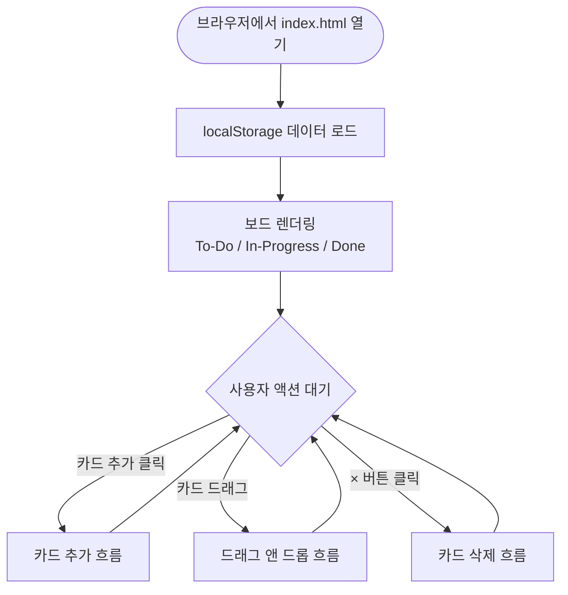
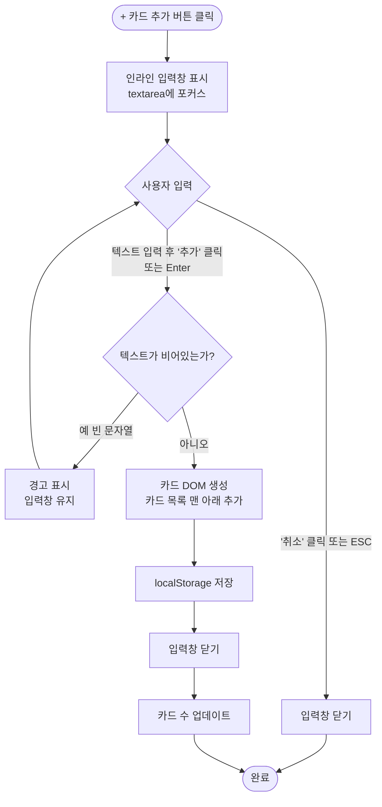
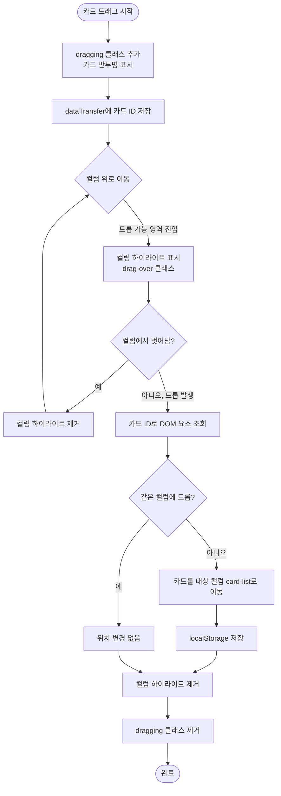
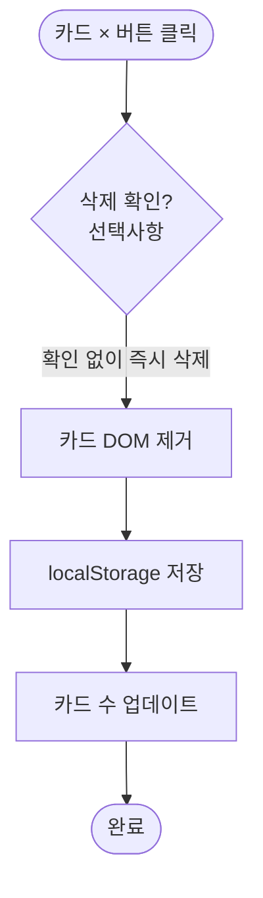
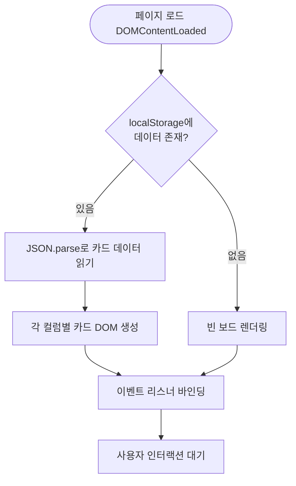

# User Flow — 사용자 흐름도

## 1. 전체 흐름 개요

```mermaid
flowchart TD
    Start([브라우저에서 index.html 열기]) --> Load[localStorage 데이터 로드]
    Load --> Render[보드 렌더링\nTo-Do / In-Progress / Done]
    Render --> Idle{사용자 액션 대기}

    Idle -->|카드 추가 클릭| AddFlow[카드 추가 흐름]
    Idle -->|카드 드래그| DragFlow[드래그 앤 드롭 흐름]
    Idle -->|× 버튼 클릭| DeleteFlow[카드 삭제 흐름]

    AddFlow --> Idle
    DragFlow --> Idle
    DeleteFlow --> Idle
```

---

## 2. 카드 추가 흐름

```mermaid
flowchart TD
    A([+ 카드 추가 버튼 클릭]) --> B[인라인 입력창 표시\ntextarea에 포커스]
    B --> C{사용자 입력}

    C -->|텍스트 입력 후 '추가' 클릭\n또는 Enter| D{텍스트가 비어있는가?}
    C -->|'취소' 클릭 또는 ESC| E[입력창 닫기]

    D -->|예 빈 문자열| F[경고 표시\n입력창 유지]
    D -->|아니오| G[카드 DOM 생성\n카드 목록 맨 아래 추가]

    G --> H[localStorage 저장]
    H --> I[입력창 닫기]
    I --> J[카드 수 업데이트]

    F --> C
    E --> K([완료])
    J --> K
```

---

## 3. 드래그 앤 드롭 흐름

```mermaid
flowchart TD
    A([카드 드래그 시작]) --> B[dragging 클래스 추가\n카드 반투명 표시]
    B --> C[dataTransfer에 카드 ID 저장]
    C --> D{컬럼 위로 이동}

    D -->|드롭 가능 영역 진입| E[컬럼 하이라이트 표시\ndrag-over 클래스]
    E --> F{컬럼에서 벗어남?}

    F -->|예| G[컬럼 하이라이트 제거]
    G --> D

    F -->|아니오, 드롭 발생| H[카드 ID로 DOM 요소 조회]
    H --> I{같은 컬럼에 드롭?}

    I -->|예| J[위치 변경 없음]
    I -->|아니오| K[카드를 대상 컬럼 card-list로 이동]

    K --> L[localStorage 저장]
    L --> M[컬럼 하이라이트 제거]
    J --> M
    M --> N[dragging 클래스 제거]
    N --> O([완료])
```

---

## 4. 카드 삭제 흐름

```mermaid
flowchart TD
    A([카드 × 버튼 클릭]) --> B{삭제 확인?\n선택사항}
    B -->|확인 없이 즉시 삭제| C[카드 DOM 제거]
    C --> D[localStorage 저장]
    D --> E[카드 수 업데이트]
    E --> F([완료])
```

---

## 5. 초기 로딩 흐름

```mermaid
flowchart TD
    A([페이지 로드 DOMContentLoaded]) --> B{localStorage에\n데이터 존재?}

    B -->|있음| C[JSON.parse로 카드 데이터 읽기]
    C --> D[각 컬럼별 카드 DOM 생성]
    D --> E[이벤트 리스너 바인딩]

    B -->|없음| F[빈 보드 렌더링]
    F --> E

    E --> G[사용자 인터랙션 대기]
```
