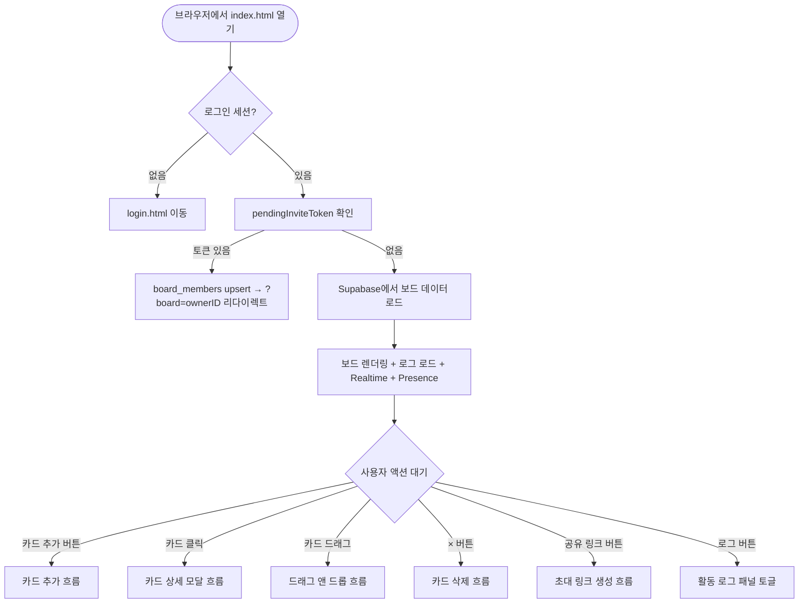
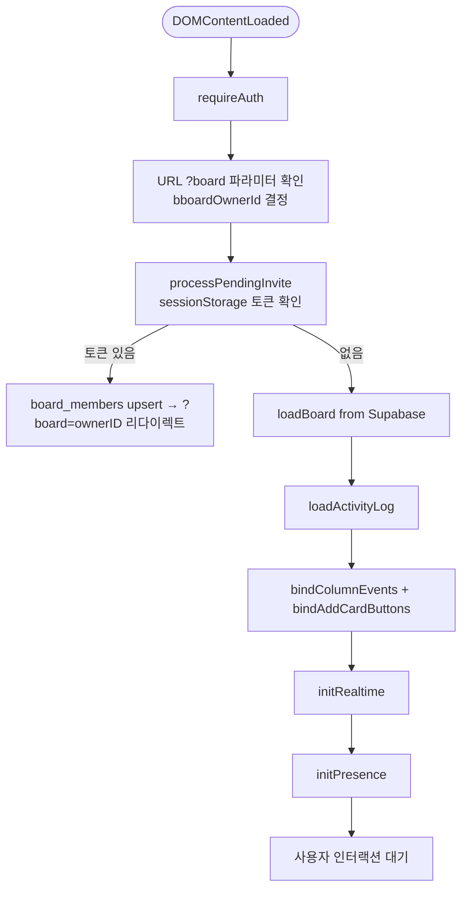
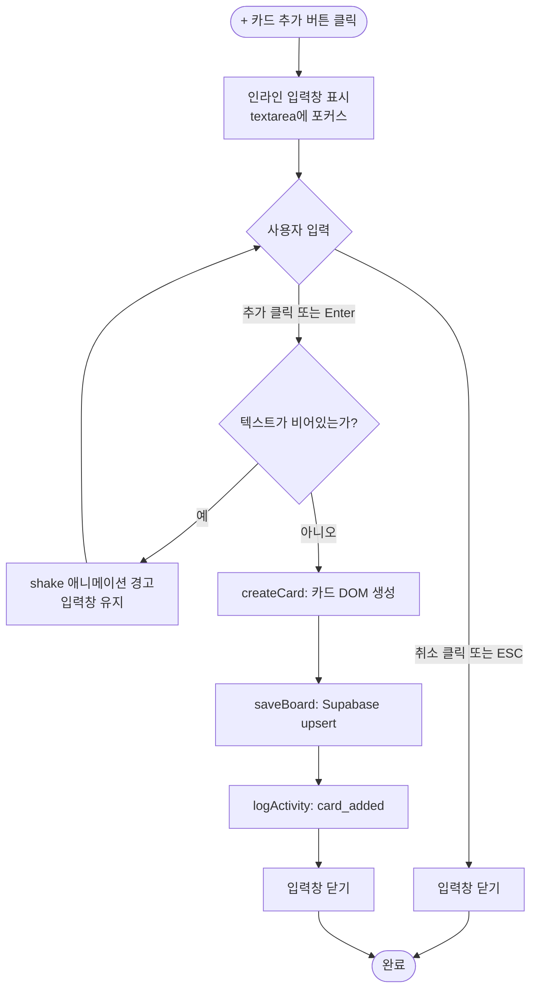
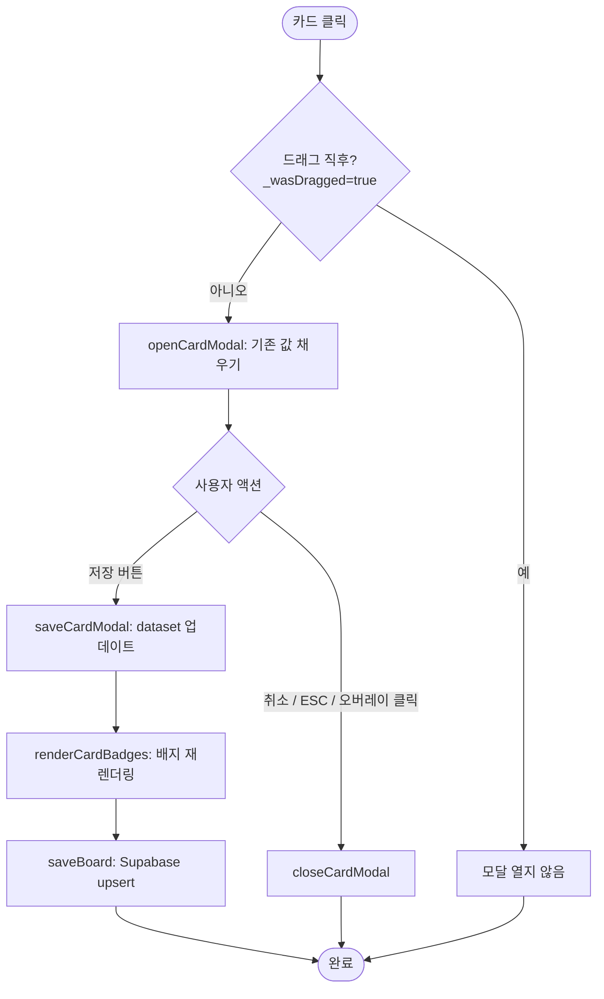
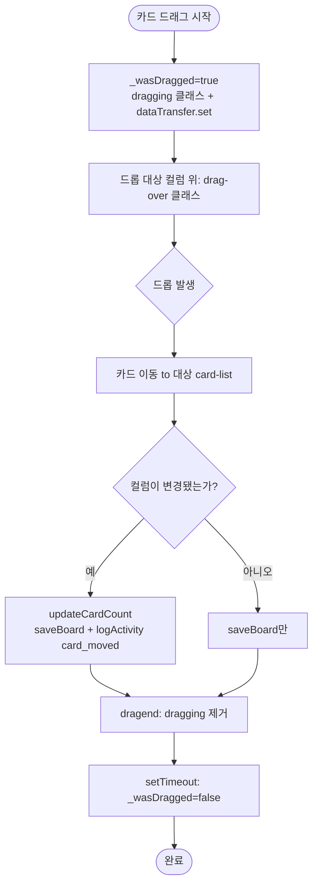
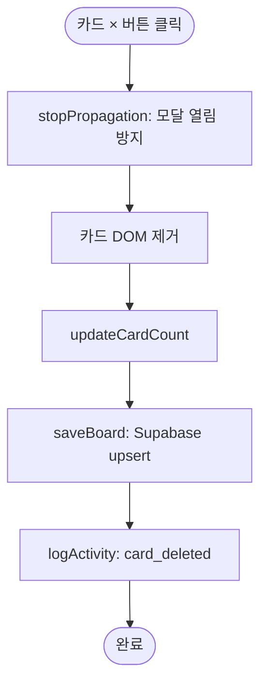
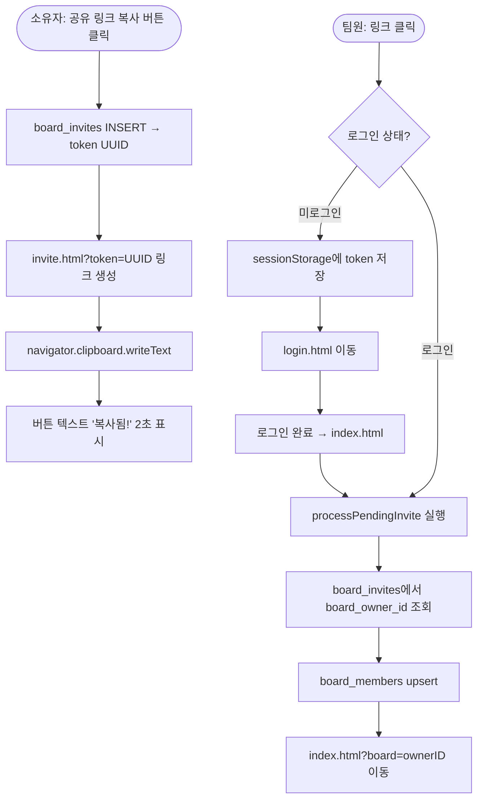
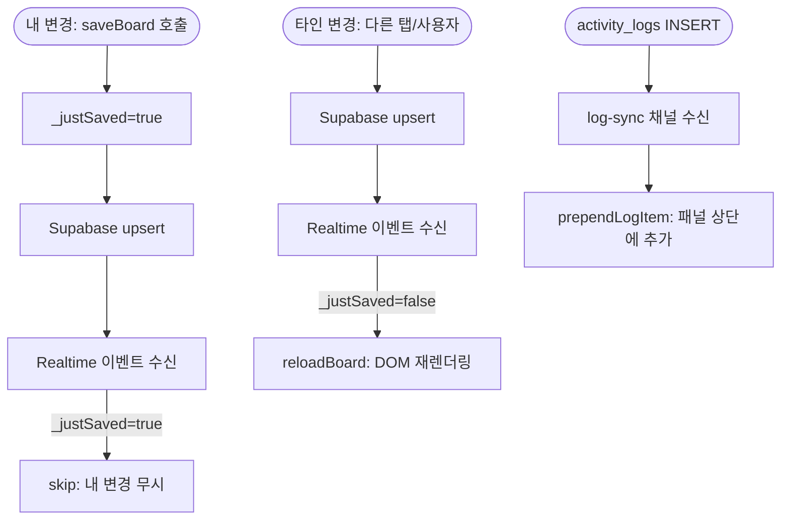

# User Flow — 사용자 흐름도

## 1. 전체 흐름 개요

---

## 2. 초기 로딩 흐름

---

## 3. 카드 추가 흐름

---

## 4. 카드 상세 모달 흐름

---

## 5. 드래그 앤 드롭 흐름

---

## 6. 카드 삭제 흐름

---

## 7. 초대 링크 공유 흐름

---

## 8. 실시간 동기화 흐름

